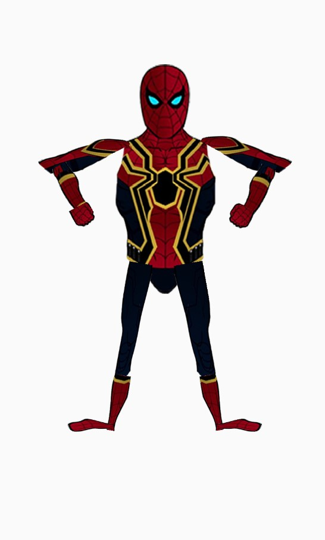
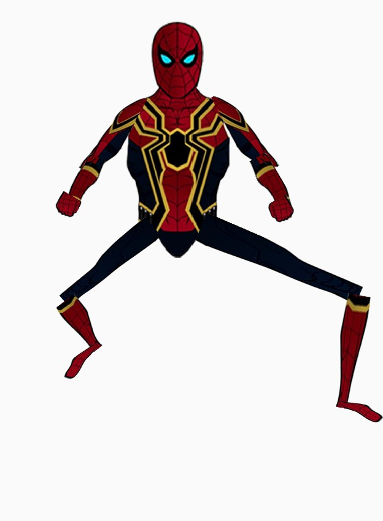

# RegDoll Android Application - Spyderman
A direct manupulated Ragdoll APP 


This is a Ragdoll APP to create a paper doll, which has features like translation, rotation and scale.

## Installation

```sh
install Ragdoll.apk on your device
```

## Reference: 
The priginal image is from: https://www.flaticon.com/categories/ui

## Usage example

### translate
- Drag the torso to translate the spyderman to different positions


### Scale 
- Scale is allowed for legs, including thign and calf. Note the foot will follow the location and degree of calf. 

```
Note: 
- Scaling upper leg will apply the same scale to lower leg.

- Scaling only happens when moving along the primary axis of leg parts
```



### Rotate 
- Head has limit of 50 degree 

- Arms have no limit(360) degree of rotation \

- lower arm has 135 degree limit with respect to upper arm 

- Thigns have 90 degree rotation limit 


- **Finger Spread has limit for upper(450) and lower legs(150)**
### Reset 

- Simply click the cross button at top right to reset Spyderman to original position

## Developer Information

- Click the exclamation mark to see developer information in a **pop up** dialog window 

